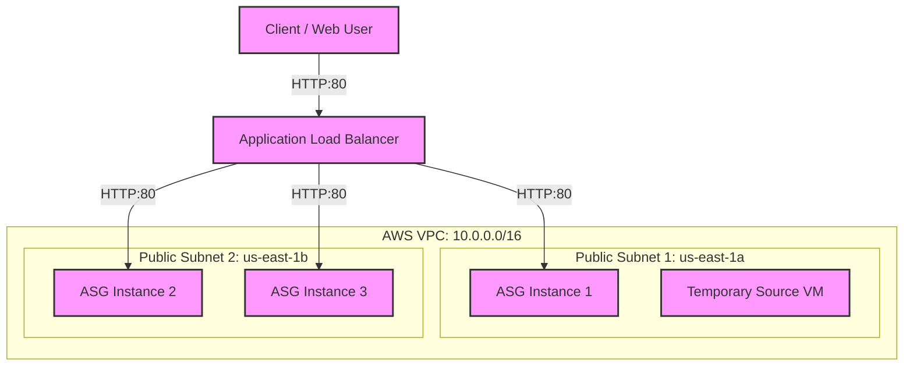

# High-Availability AWS Web Infrastructure with Terraform

This project deploys a secure, highly available, and auto-scaled web server infrastructure on AWS using Terraform. It segregates resources into discrete modules (network and compute), bakes a custom golden AMI from a temporary source VM, sets up a scale set of 3 instances, registers them behind an external Application Load Balancer with health checks, restricts traffic using security group firewalls, and maintains state in an S3 remote backend.

---

## Architecture Overview



### Resource Segregation (Modules)
1. **Network Module (`/modules/network`)**:
   * **VPC**: `10.0.0.0/16`
   * **Subnets**: 2 Public Subnets in different Availability Zones (for HA).
   * **Internet Gateway & Route Tables**: Configures routes to make subnets public.
   * **Firewall (Load Balancer SG)**: Restricts incoming HTTP access (port 80) to a specific IP range (configured via `allowed_ip_range`).
2. **Compute Module (`/modules/compute`)**:
   * **Temporary VM**: Used to install the Apache HTTP server baseline and initial website.
   * **Golden AMI**: Baked automatically from the temporary VM EBS snapshot once the installation is complete.
   * **Launch Template**: Definess EC2 configurations (t3.micro, public IP, security group, and user data to dynamically display the instance's unique hostname).
   * **Auto Scaling Group (Scale Set)**: Configured to maintain exactly 3 instances distributed across public subnets, using rolling `instance_refresh` updates.
   * **Application Load Balancer (ALB) & Target Group**: Listens on port 80, routes traffic, and runs health checks on backend instances.

---

## Technical Features & Solved Gotchas

### 1. Golden AMI Race Condition Fix
To ensure the custom AMI has the HTTP server fully installed:
* Terraform creates `temp_vm` and runs the `user_data` script (cloud-init).
* A `local-exec` provisioner forces a `sleep 120` execution. This gives the operating system sufficient time to complete package updates (`dnf update`) and Apache installation (`dnf install httpd`) before Terraform initiates the snapshotting API call to bake the AMI.

### 2. Dynamic Hostname substitution
Each scale set instance runs a startup user-data script to generate `/var/www/html/index.html` with its own system hostname:
* In Terraform, a single `$` is used for `$(hostname -f)` since HCL only evaluates `${...}` for string interpolation.
* On boot, bash dynamically runs `hostname -f` and writes it to `index.html`.

### 3. Automatic Rolling Updates (`instance_refresh`)
The Auto Scaling Group references the launch template version dynamically via `aws_launch_template.asg_template.latest_version`. Whenever code updates are made to the launch template, Terraform automatically triggers an ASG `instance_refresh` to perform a rolling update of all running EC2 instances without downtime.

---

## Setup & Deployment

### Prerequisites
1. Installed **AWS CLI** and configured with access credentials.
2. Installed **Terraform (v1.0.0+)**.
3. An existing **S3 bucket** to act as the remote backend (defined in `providers.tf`).

### Configuration
Update the variables in `variables.tf`:
```hcl
variable "aws_region" {
  type    = string
  default = "us-east-1"
}

variable "allowed_ip_range" {
  type        = string
  default     = "0.0.0.0/0" # CHANGE THIS to restrict access to your personal public IP range (e.g., "203.0.113.50/32")
}
```

### Steps to Run
1. **Initialize Terraform** (installs providers and configures remote state backend):
   ```bash
   terraform init
   ```
2. **Review Deployment Plan**:
   ```bash
   terraform plan
   ```
3. **Apply Changes**:
   ```bash
   terraform apply -auto-approve
   ```

---

## Verification

1. **Check outputs** after apply completes:
   ```bash
   Outputs:
   load_balancer_dns = "tf-external-lb-1617367488.us-east-1.elb.amazonaws.com"
   ```
2. **Access the Application**:
   Send HTTP requests to the Load Balancer DNS name to confirm round-robin routing:
   ```bash
   for i in {1..5}; do curl -s http://<load_balancer_dns>; done
   ```
   *Expected Output* (showing different EC2 hostname values on each request):
   ```html
   <h1>Hello from HA Web Server: ip-10-0-1-114.ec2.internal</h1>
   <h1>Hello from HA Web Server: ip-10-0-2-235.ec2.internal</h1>
   <h1>Hello from HA Web Server: ip-10-0-2-54.ec2.internal</h1>
   ...
   ```
3. **Verify Security Firewall**:
   Ensure you cannot connect directly to backend instances via their public IPs, as ingress rules inside `vm_sg` only permit traffic originating from the Load Balancer security group (`lb_sg`).

---

## Tear Down / Destruction
To clean up and delete all created AWS resources to prevent charges:
```bash
terraform destroy -auto-approve
```
